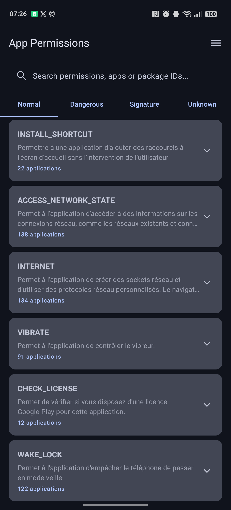
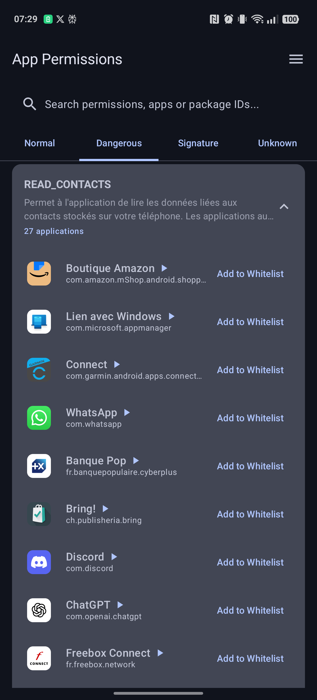

# Android Permission Manager


An Android application that scans all installed apps on your device and categorizes their permissions by danger level. This app provides a user-friendly interface to explore which apps use specific permissions and understand the potential security implications.

## Features

- **Comprehensive Permission Analysis**: Lists all permissions used by installed applications
- **Danger Level Categorization**: Groups permissions by danger level (Normal, Dangerous, Signature, Unknown)
- **Advanced Search Functionality**: Search by permission name, app name, or package ID
- **Detailed App Information**: Shows which apps use each permission with app icons and package details
- **Modern UI**: Built with Jetpack Compose and Material 3 design guidelines

## Screenshots

<table>
  <tr>
    <td></td>
    <td></td>
  </tr>
  <tr>
    <td><b>Permissions View</b>: Categorized permissions by danger level</td>
    <td><b>Apps View</b>: Details of apps using specific permissions</td>
  </tr>
</table>

## Requirements

- Android 7.0 (API level 24) or higher
- Android Studio Hedgehog (2023.1.1) or newer

## Installation

### From Source

1. Clone the repository

   ```bash
   git clone https://github.com/corneflex/AndroidPermission.git
   ```

2. Open the project in Android Studio

3. Build and run the application on your device or emulator

## Usage

1. Launch the app
2. Browse permissions by danger level using the tabs
3. Use the search bar to find specific permissions, apps, or package IDs
4. Tap on a permission to see which apps use it

## Why This App?

Many applications request permissions that may compromise your privacy or security. This app helps you:

- Identify which apps have access to sensitive permissions like location, camera, or contacts
- Discover hidden permissions that apps might be using
- Make informed decisions about which apps to keep or uninstall based on their permission usage

## Technical Details

The app is built using:

- **Kotlin**: Modern, concise programming language for Android
- **Jetpack Compose**: Declarative UI toolkit for building native Android UIs
- **MVVM Architecture**: Clean separation of UI, logic, and data
- **LiveData**: Observable data holder for lifecycle-aware observations
- **Material 3**: Latest design system from Google for modern UI
- **Coroutines**: Asynchronous programming for smooth performance

### Project Structure

- **model**: Data classes for apps and permissions
- **util**: Utility functions for accessing system information
- **viewmodel**: Business logic and state management
- **ui/components**: Compose UI elements

## Permissions Used

The app requires the following permission:

- `QUERY_ALL_PACKAGES`: To access information about installed packages (required for core functionality)

## Contributing

Contributions are welcome! Feel free to:

- Report bugs
- Suggest features
- Submit pull requests

## License

This project is licensed under the MIT License - see the [LICENSE](LICENSE) file for details.

## Acknowledgments

- Android documentation for permission management
- Jetpack Compose documentation and codelabs
- Material Design guidelines
